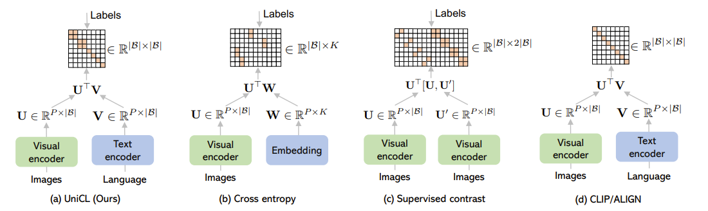

# UniCL-OpenCLIP

This is an open source implementation of Microsoft's UniCL:

["**Unifiled Contrastive Learning in Image-Text-Label Space. CVPR 2022**"](https://arxiv.org/abs/2204.03610) by [Jianwei Yang*](https://jwyang.github.io/), [Chunyuan Li*](https://chunyuan.li/), [Pengchuan Zhang*](https://pzzhang.github.io/pzzhang/), [Bin Xiao*](https://www.microsoft.com/en-us/research/people/bixi/), [Ce Liu](http://people.csail.mit.edu/celiu/), [Lu Yuan](https://scholar.google.com/citations?user=k9TsUVsAAAAJ&hl=en) and [Jianfeng Gao](https://www.microsoft.com/en-us/research/people/jfgao/?from=http%3A%2F%2Fresearch.microsoft.com%2Fen-us%2Fum%2Fpeople%2Fjfgao%2F).

The UniCL loss function is implemented [here](https://github.com/Computer-Vision-in-the-Wild/UniCL-OpenCLIP/blob/master/src/open_clip/loss.py#L178).

The codebase is forked from [open_clip](https://github.com/mlfoundations/open_clip). This repo is implemented and updated by [Zihao Lin](https://www.zihaolinqz.com).

## Introduction
<p align="center">
  
</p>

In this paper, we introduce a new perspective on commonly used image-label and image-text data by residing them in an image-text-label space. In this space, a new learning paradigm, called **Unified Contrastive Learning (UniCL)** with a single learning objective is proposed to seamlessly prompt the synergy of two data types. We demonstrate that UniCL is an effective way of learning **semantically rich yet discriminative representations**, universally for image recognition in zero-shot, linear-probe, fully finetuning and transfer learning scenarios. When scaled up to billions of data, UniCL can exclusively learn a powerful visual-semantic representation supporting dozens of downstream tasks shown in [Florence](https://arxiv.org/pdf/2111.11432v1.pdf).

We make the comparisons between UniCL with coventional learning methods below:

<p align="center">
  
</p>


## Installation
Please follow [open_clip](https://github.com/mlfoundations/open_clip) for setting up environment, downloading datasets.

## Data preparation

To prepare datasets in [ELEVATER benchmark](https://github.com/Computer-Vision-in-the-Wild/Elevater_Toolkit_IC), please follow [this instruction](https://github.com/Computer-Vision-in-the-Wild/DataDownload).

To prepare ImageNet-1K dataset, please follow [DATA.md](https://github.com/microsoft/UniCL/blob/main/DATA.md).

To prepare Conceptual Captions dataset, YYCC or other datasets, please follow [this instruction](https://github.com/mlfoundations/open_clip#data).

After downloading your datasets to `./data/` folder, you need to create two csv files of the training and testing sets and save them to `./data/`. The format of csv/tsv file is shown as follows (please also check the examples of csv file [here](https://github.com/Computer-Vision-in-the-Wild/UniCL-OpenCLIP/tree/master/data)):


| filepath | title | labels 
| :----: | :---: | :---: 
| ./cifar_10_20211007/train/1/2519.png | a black and white photo of a automobile. | 1 
| ./cifar_10_20211007/train/6/449.png | a bad photo of the frog. | 6 


Note: right now, you need to create the csv file offline. We are working on implementing a method to automatically do this. You can use the [examples](https://github.com/Computer-Vision-in-the-Wild/UniCL-OpenCLIP/tree/master/data) to run a 50-shots cifar-10 image classification datasets.

To use UniCL loss, you must have `labels` column whose type is `int (number)` in your csv file; if you use CLIP loss, `labels` column is not required.

## Train UniCL

- Specify the loss function you need by setting `--loss UniCL` or `--loss CLIP`.
- Specify the csv information used to prepare dataloader: `--csv-img-key filepath`, `--csv-caption-key title` and `--csv-label-key labels` represents the column names of image path, corresponding texts and labels.
- Specify evaluation metrics for downstream image classification tasks: if you want to use metrics function introduced in [ELEVATER](https://github.com/Computer-Vision-in-the-Wild/Elevater_Toolkit_IC), specify the evaluation type `--eval_type elevater`, the metrics function `--metrics accuracy`, and the evaluation dataset name `--val_dataset cifar-10`. The details for evaluation is discussed [here](https://github.com/Computer-Vision-in-the-Wild/UniCL-OpenCLIP#evaluate). If you plan to use UniCL to train downstream image classification tasks, we strongly recommend you to use ELEVATER method to evaluate your model.

We provide an example for you to run a 50-shots cifar-10 image classification task, you can first download cifar-10 dataset to `./data/` following [this link](https://github.com/Computer-Vision-in-the-Wild/DataDownload), unzip the downloaded dataset, then run the following single-process running code:

```
cd src

python -m training.main \
  --train-data "../data/cifar-10-rand_2-shot_50.csv" \  # change to your own dataset path
    --val-data "../data/test_cifar-10.csv"  \  # change to your own dataset path
    --val_dataset "cifar-10" \
    --loss UniCL \
    --report-to wandb \
    --csv-img-key filepath \
    --csv-caption-key  title \
    --csv-label-key labels \
    --csv-separator "," \
    --warmup 500 \
    --batch-size 32 \
    --lr 1e-5 \
    --wd 0.05 \
    --epochs 200 \
    --workers 1 \
    --model "ViT-B-32" \
    --local-loss \
    --gather-with-grad \
    --pretrained "openai" \
    --save-frequency 10 \
    --metrics "accuracy" \
    --eval_type "elevater" \
    --eval_frequency 10
```

Note: be careful for the hyperparameters. You may tune them manually because this code does not support automatically hyperparameter tunning.

To train the UniCL using **SLURM**, or using multi-gpu training process, we provide a shell script for you. To use it, you may run 

```
cd src
bash run.sh
```

For more training details, please follow [open_clip](https://github.com/mlfoundations/open_clip#training-clip) .

## Evaluate

This repo also supports evaluation on downstream Image Classification dataset in [ELEVATER benchmark](https://github.com/Computer-Vision-in-the-Wild/Elevater_Toolkit_IC). 

To use the evaluation method in ELEVATER, you first need to specify `--eval_type elevater`. Then, specify `--metrics` for one of the four types of metrics: `accuracy`, `11point_mAP`, `roc_auc` and `mean-per-class`; and specify the evaluation dataset, e.g. `--val_dataset cifar-10`. You may need to check the ELEVATER [paper](https://arxiv.org/abs/2204.08790) to see the corresponding metrics for each dataset.

Right now, ELEVATER supports 20 datasets. Make sure that your specified dataset name is one of the followings: `food-101`, `oxford-iiit-pets`, `resisc45_clip`, `mnist`, `kitti-distance`, `oxford-flower-102`, `gtsrb`, `cifar-100`, `patch-camelyon`, `stanford-cars`, `fgvc-aircraft-2013b-variants102`, `fer-2013`, `rendered-sst2`, `dtd`, `country211`, `cifar-10`, `caltech-101`, `eurosat_clip`, `hateful-memes`, `voc-2007-classification`.

You can customize your own dataset by adding new templates and label names to `src/datasets/prompts.py` and specify your customized dataset name by `--val_dataset <your dataset name>`.

To only evaluate but not to train, you can just ignore adding `--train-data`.

Right now, this repo does not support adding external knowledge ([K-LITE](https://github.com/Computer-Vision-in-the-Wild/klite)), and not support multi-label dataset `voc-2007-classification`. We are working on these!


## Citation

If you find this repo useful to your project, please consider to cite UniCL or/ and ELEVATER with the following bibs:

```bibtex
@misc{yang2022unified,
    title={Unified Contrastive Learning in Image-Text-Label Space}, 
    author={Jianwei Yang and Chunyuan Li and Pengchuan Zhang and Bin Xiao and Ce Liu and Lu Yuan and Jianfeng Gao},
    year={2022},
    eprint={2204.03610},
    archivePrefix={arXiv},
    primaryClass={cs.CV}
}
```

and

```bibtex
@article{li2022elevater,
    title={ELEVATER: A Benchmark and Toolkit for Evaluating Language-Augmented Visual Models},
    author={Li, Chunyuan and Liu, Haotian and Li, Liunian Harold and Zhang, Pengchuan and Aneja, Jyoti and Yang, Jianwei and Jin, Ping and Lee, Yong Jae and Hu, Houdong and Liu, Zicheng and Gao, Jianfeng},
    journal={Neural Information Processing Systems},
    year={2022}
}
```
